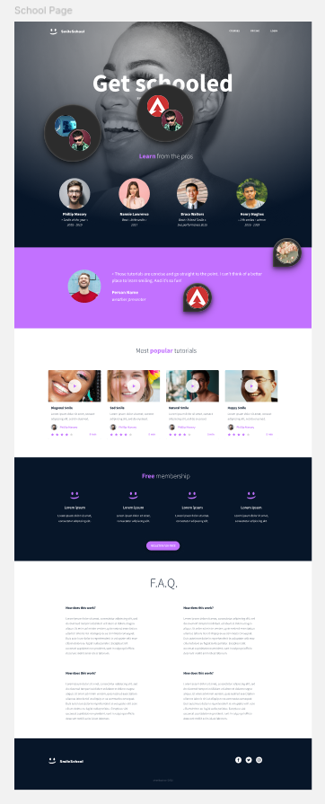

# CSS Advanced - Webpage Structure

This project focuses on building the structural foundation of a website using semantic HTML based on a Figma design. By implementing CSS and styling, the goal is to master the hierarchy of elements and ensure the document is accessible, well-organized, and follows modern web standards.

## Learning Objectives
- Understand the difference between structure and style.
- Implement a wireframe into clean HTML code.
- Use semantic tags to define page sections.